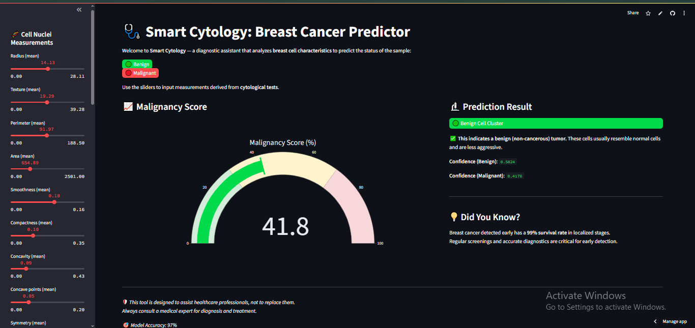

# 🩺 Smart Cytology: Breast Cancer Predictor

A simple, fast ML app to predict if a tumor is **Benign** or **Malignant** based on 30 cytology features — powered by Logistic Regression.

🔗 Try it live: [breast-cancer-predictor-007.streamlit.app](https://breast-cancer-predictor-007.streamlit.app/)

---

## 📊 Features

Uses 30 key features from cell nuclei measurements, grouped as:

- Radius, Texture, Perimeter, Area  
- Smoothness, Compactness, Concavity, Concave Points  
- Symmetry, Fractal Dimension  

Each in `mean`, `se` (standard error), and `worst` values.

---

## 🚀 How to Use

1. Visit the [Live App](https://breast-cancer-predictor-007.streamlit.app/)  
2. Adjust sliders to enter feature values  
3. See instant prediction: `Benign` or `Malignant`

---

## 🧠 Model Info

- Algorithm: Logistic Regression  
- Preprocessing: StandardScaler normalization  
- Dataset: Breast Cancer Wisconsin (Diagnostic)  
- Accuracy: ~97%

---

## 📁 Project Structure

```
├── app.py                              # Main Streamlit app
├── model.pkl                           # Trained ML model
├── scaler.pkl                          # Feature scaler
├── data.csv                            # Raw dataset
├── requirements.txt                    # Dependencies
├── breast_cancer_logistic_model.ipynb  # Training dataset
├── assets/
│   └── style.css                       # Custom Streamlit styling
└── .gitignore
```

---

## 🛠️ Tech Stack

Python | Pandas | Scikit-learn | Streamlit | Jupyter Notebook

---

## 🧪 Run Locally

```bash
# Clone the repo
git clone https://github.com/adeel-iqbal/breast-cancer-predictor.git
cd breast-cancer-predictor

# Install dependencies
pip install -r requirements.txt

# Run the app
streamlit run app.py
```

---

## 🖼️ App Preview

Here's the screenshots of the app interface:




## 👤 Author

Made with ❤️ by **Adeel Iqbal**  
🔗 GitHub: [@adeel-iqbal](https://github.com/adeel-iqbal)
